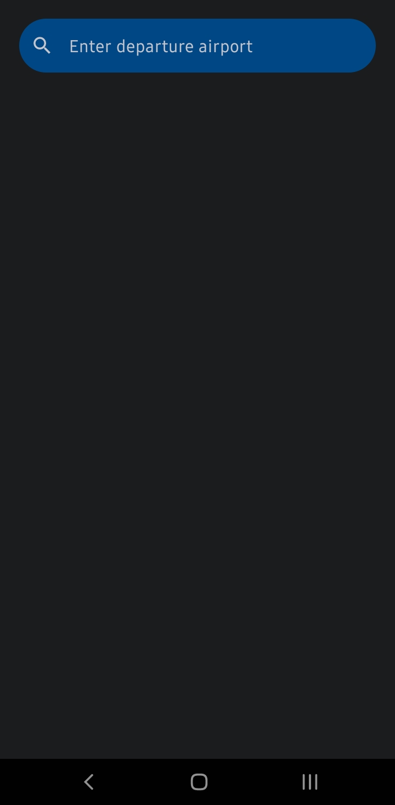
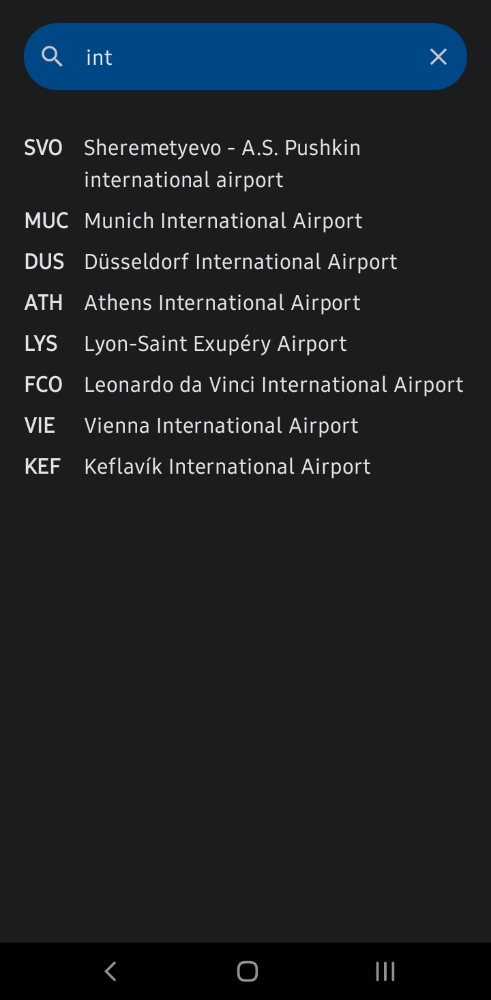
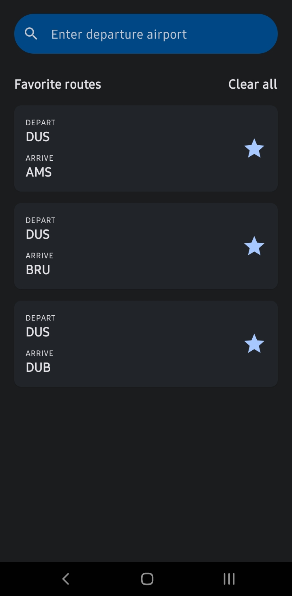

# FlightSearch
FlightSearch is an easy-to-use application that grants users access to flight information. This app enables users to find suitable flight options by inputting search queries, providing them with flight recommendations sourced from a database. Users can explore available flights when selecting a specific airport and save them with a single click for future retrieval.

## Features
- **Explore Available Flights** - Upon selecting a specific airport, users can access a list of available flights.
- **Storage** - Users can store their favorite flights in the database for future reference and retrieval.

## Data Storage
Application utilizes two key data storage mechanisms:
- **Room Database** - Room is used to efficiently manage the storage of flight information. This database is the backbone of the app, facilitating the retrieval and storage of flight data.
- **DataStore** - DataStore provides a reliable solution for saving and retrieving user preferences, including their input in the search bar.

## Preview

    &nbsp;&nbsp;
    &nbsp;&nbsp;
    &nbsp;&nbsp;
    

